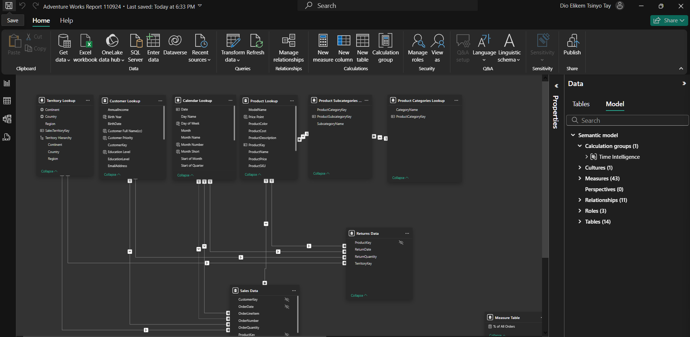
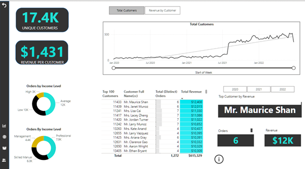
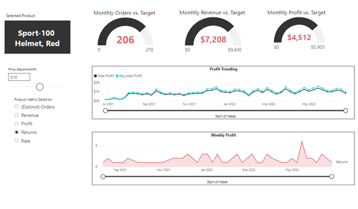
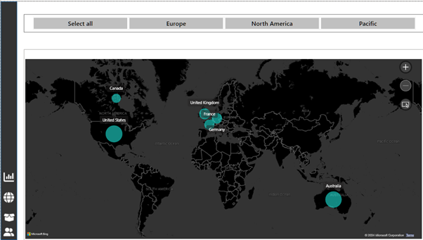

## Adventure Works Dashboard

**Business Situation**

Adventure Works, a fictional manufacturer of cycling equipment and accessories, requires a comprehensive dashboard to monitor key performance indicators (KPIs) such as sales, revenue, profit, and returns. 

**Data Analysis Objectives**

The dashboard must enable management to:
1. Track and compare performance across regions.
2. Analyze trends at the product level.
3. Identify and prioritize high-value customers.

**Data sets**

The project involves working with a folder containing 14 raw CSV datasets, each with up to 36,000 rows. These datasets include information on transactions, returns, products, customers, and sales territories, providing the foundation for in-depth analysis and actionable insights.
   
**Skills & Concepts Demonstrated**

- Power Query: data Loading and Cleaning, Profiling, Quality Assurance, Unpivoting
- DAX :Calculated Coumns, Measures (Implicit, Explicit), Rolling Calendar, Modelling- Snowflake Schema ( One to Many Cardinality, Hierarchies, Active and Inactive Relationships, Bi-directional filtering), Data Formating and Category typing.

 ## Executive Summary

**Overall Performance**
1.  Total Revenue: Business recorded Total Revenue of $24M from Jan 2020 to Jan 2022 and a Gross Profit of $10M,representing a healthy 41% Gross Margin.
2.  Annual Revenue trended at $500K-$600k from Jan 2020 to July 2021 but afterwards trended sharply upward till YTD Jan 2022 at $1.8M.
3. Customer Performance & Trend: Maurice Shan is No.1 Top Customer, presenting opportunity to potentially cross fertilize his business model to other customers for growth.
4. Also, whilst the number of customers increased to 17,000, revenue by customer is trending downward, presenting opportunities to improve customer quality and not just the quantity.Customer Trends.
5.  Sales volumes: accessories topped with 17k units, followed by Bikes (14k) and clothing (7k), presenting a potential opportunity to double down on investment on accesories to ensure to no supply disruptions or stock-outs.
6.  Return rate was 2.2% Return (below benchmark of 3%).
   
**Monthly Revenue Trend**
1.  Monthly revenue trended around $600K from Jan 2020 but sharply declined to 300K in Nov 2020,
2.  it picked up from June 2021 at $560K, surging to $800k in July 2021, and been on phenomenal upward trend to $1.8M ever since.
3.  Revenue is projected to hit max of $1.9M.
 
 ### Data Model  
1. The Adventure Works dataset is complex as it came with 2 fact tables- Sales Transactions and Returns fact tables and 6 Dimension Tables, 2 of which had 2 subcategory level.
2. Owing the its dual fact tables and the subrelationships in the dimensions tables to enable cross filtering between both fact tables, a Snowflake data model was built rather than a Star Schema model.
3. 43 explicit measures were built using DAX, rather implicit measures. Unlike implicit measures (by drag and drop and limited to one visual), explicit measures are DAX formula based and can be used anywhere in the model, hence more versatile and efficient.

 ### Data Visualization
 Data Viz Best Practices including:
1. **Gestalt pricinples** were use to position data cards of Revenue, Profit and Return from Left to right and keep them together (Proximity)
2. **Bookmarks** capturing the current state of a page, so users can return to it in its initial state (ease of navigation)
3. **User Roles** (for the right level security access/restrictions)
4. **KPI Cards** to instantly visualize KPIs against targets.
5. **Drill Through, Drill Down and Custom Tooltips**: to intuively navigate from one report to the other.
6.**Top N Cards**:to highlights Top Customer and Top Product names.
7. **Field parameters**: to allow users to dynamically change the metrics or dimensions in the report visual
8. **Numeric Range parameters**: for simulation and Scenario analysis to assess for instance impact of different price points or discounts.

**Customer Dashboad** 
- highlightsTop Customer by Revenue, Number of Customers, Average Revenue by Customer and Orders by Income levels and occupations Categories.
- Maurice Shan is No.1 Top Customer, presenting opportunity to potentially cross fertilize his business model to other customers for growth.
- Also, whilst the number of customers increased to 17,000, revenue by customer is trending downwar, presenting opportunities to improve customer quality and not just the quantity.

**Product Dashboard**
1.  Field parameters of Distinct orders, Revenue, Profit, Returns and Return Rate allow users to dynamically change the metrics or dimensions in the report visual for various insights
2.  Nunmeric Range parameters of enable scenario analysis of impact of prices changes in adjusted Profit vs total Profit.
3.  Gauge charts were also used to vizualize Monthly Targets for Orders, Revenue and Profit vs Actuals.
   

**Revenue Size by Georaphy Map**
1.  US tops Revenue contribution chart, followed by Australia, UK, Germany, France and Canada.

