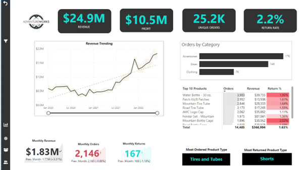

# Adventure Works Management Dashboard

**Business Situation** Adventure Work is a fictional cycling equipment and accesories company.
Management needs a dasbboard to track KPIs (sales, revenue, profit, returns), compare regional performance, analyze product-level trends, and identify high-value customers.
We have a folder of raw csv files, contaning Transactions, Returns, Products, Customers, and Sales Territories.

**Data Analysis Objectives**:

Deploy PowerBi to:

-Connect and transform the raw data.

-Build a relational data model.

-Create calculated columns and measures with DAX.

-Design an interactive dashboard to visualize the data.

